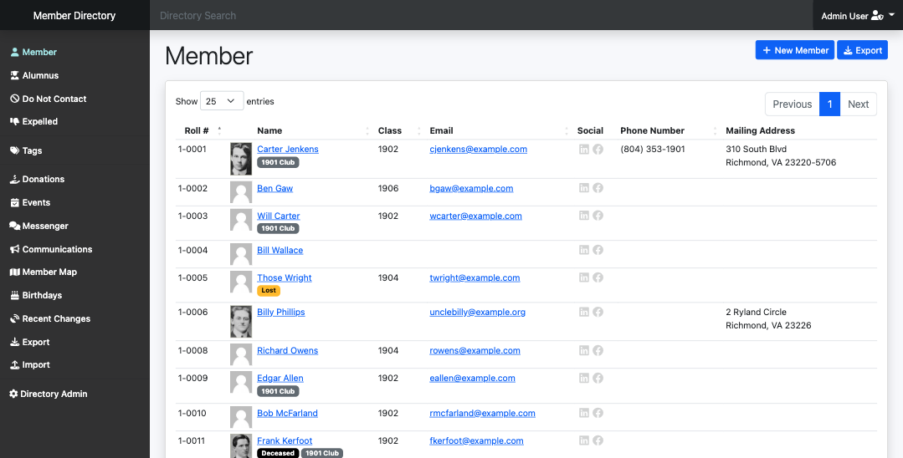

# Member Directory

## Developer Quickstart

```bash
git clone git@github.com:tacman/member-directory.git --branch sy64-with-assetmapper && cd member-directory
echo "DATABASE_URL=sqlite:///%kernel.project_dir%/var/data.db" > .env.local
composer install
bin/console importmap:install
bin/console doctrine:schema:update --force --complete
bin/console doctrine:fixtures:load -n
symfony server:start -d
symfony open:local
echo "login as admin@example.com/testing"
```

bin/console importmap:require fos_routing --path=vendor/friendsofsymfony/jsrouting-bundle/Resources/public/js/router.min.js

[](https://github.com/utmsigep/member-directory/actions/workflows/php-cs-fixer.yml) [](https://github.com/utmsigep/member-directory/actions/workflows/ci.yml)

Member Directory is a [Symfony](https://symfony.com/) project to manage membership records. It offers automated email service subscription management, donation tracking and integrated communication logging. A suite of user roles allow administrators to delegate tasks to other users.




### Learn More

- [Feature Highlights](https://utmsigep.github.io/member-directory)
- [Developer Quick Start](https://github.com/utmsigep/member-directory/wiki/Developer-Quick-Start)

## Database

When using MySQL, note the following:

* migrations won't work
* change doctrine.yaml to the MySQL date functions (for birthdays)
* Change the DATABASE_URL

## Notes

Additional member fixtures from

```bash
curl 'https://dummyjson.com/users?limit=100' > src/DataFixtures/dummyusers.json
```
