# Overview

Member Directory is a [Symfony](https://symfony.com/) 5 project to manage the membership records of a local chapter of a larger, national organization. It has a handful of useful features:

* **CSV imports** that update records based on a common identifier
* **CSV exports** for use in other systems or building call lists
* **Email subscription management** through [Campaign Monitor](https://www.campaignmonitor.com/)
* **Directory Collections** to create easy to browse views of your membership roster
* **Member messaging** through email or SMS with [Twilio](twilio.com/)
* **Communication logging** to keep your team in sync
* **Event attendance tracking** to see engagement at a glance
* **Mailing address validation** through the USPS
* **Geolocation and mapping** through Census data in the United States
* **Record history** for tracking changes to member records
* **Role-based access** for various directory features (donations, communications, etc.)
* **Tagging** of membership records to indicate committees or extra data
* **Donation tracking** via [Donorbox](https://donorbox.org) import or manual entry
* **Self-service record updates** via unique, one-time use URLs
* **Role-based user management** to give users only the access they need
* **Two-Factor Security** (optional) to help keep your member data safe

## Feature Screenshots

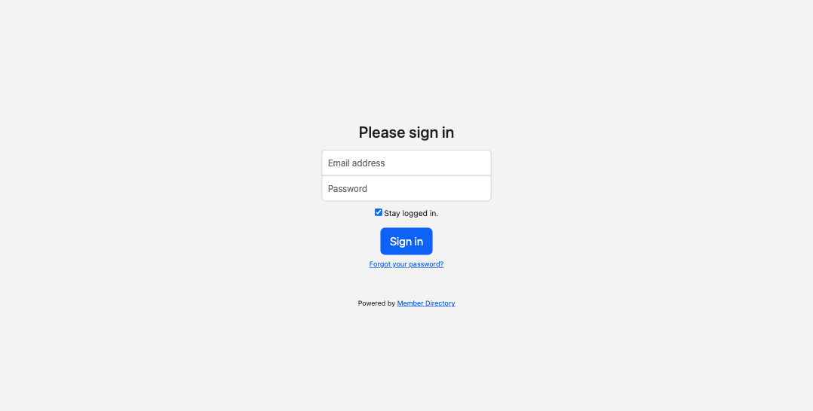

Users login with their email address.

---

A Directory Collection is a customizable view of your membership roster.

---

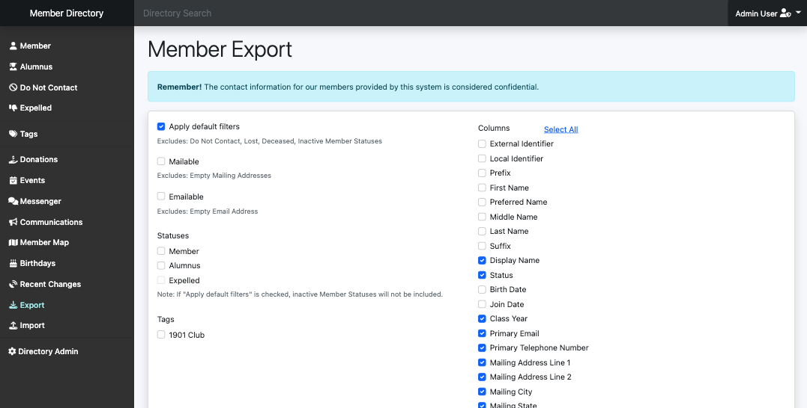

You can export member lists, based on your criteria, to a CSV file.

---

Similarly, you can import members from a CSV file to create or update their record.

---

[Geocodio](https://www.geocod.io/) (optional) and the US Census APIs allow you to approximate the mailing addresses of your members. You can also set their GPS coordinates in the backend.

---

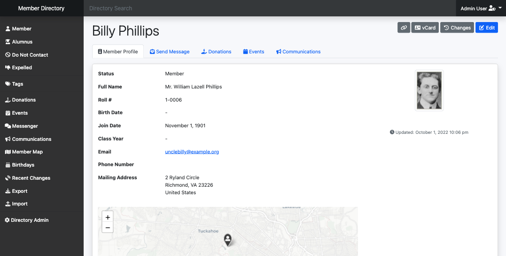

This is the information stored with a Member record.

---

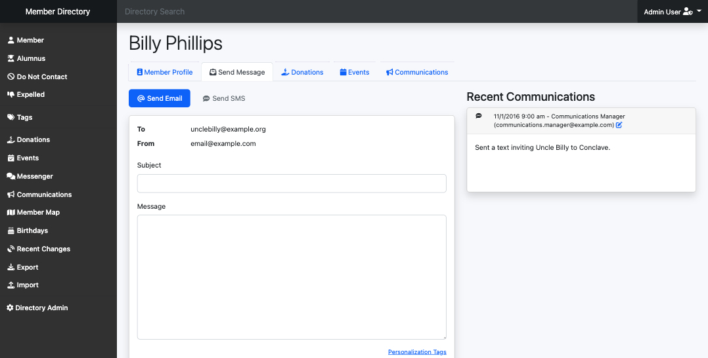

Individual emails can be sent through the site, with the ability to replace personalization tags with member data.

---

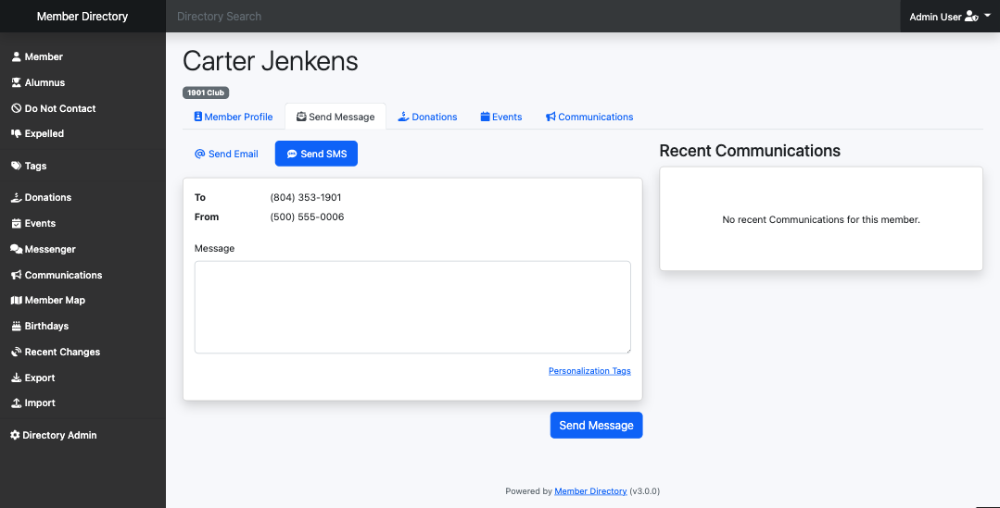

With the optional SMS provider integration, you can send text messages to your members through the site.

---

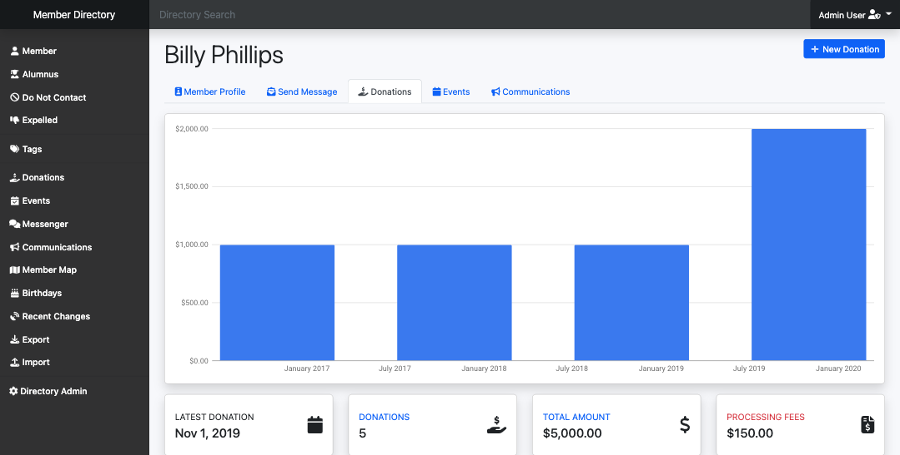

For donation based organizations, you can track the donor record for your members.

---

Track event attendance to measure involvement.

---

Track communications with your members to keep your team in sync.

---

Send mass emails or SMS messages to lists of members.

---

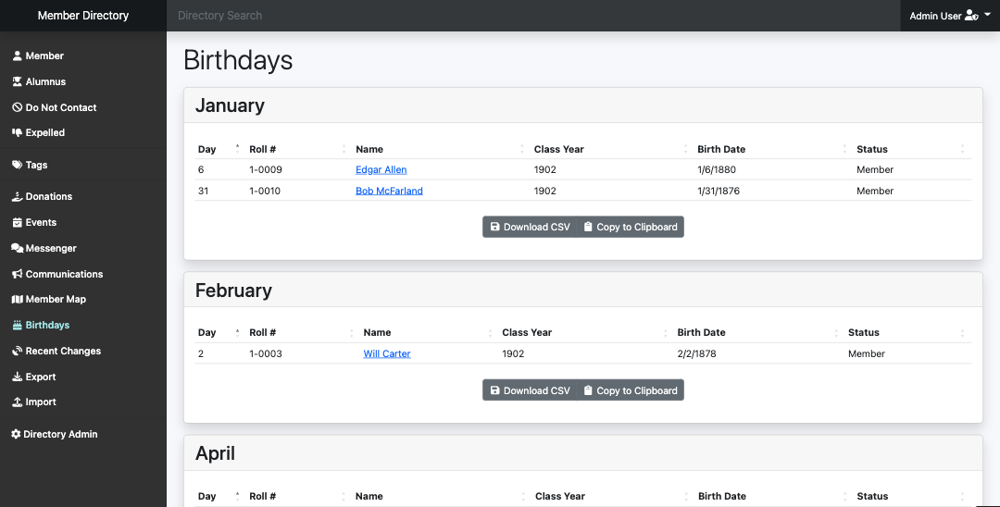

A birthday view simplifies celebrating monthly member birthdays.

---

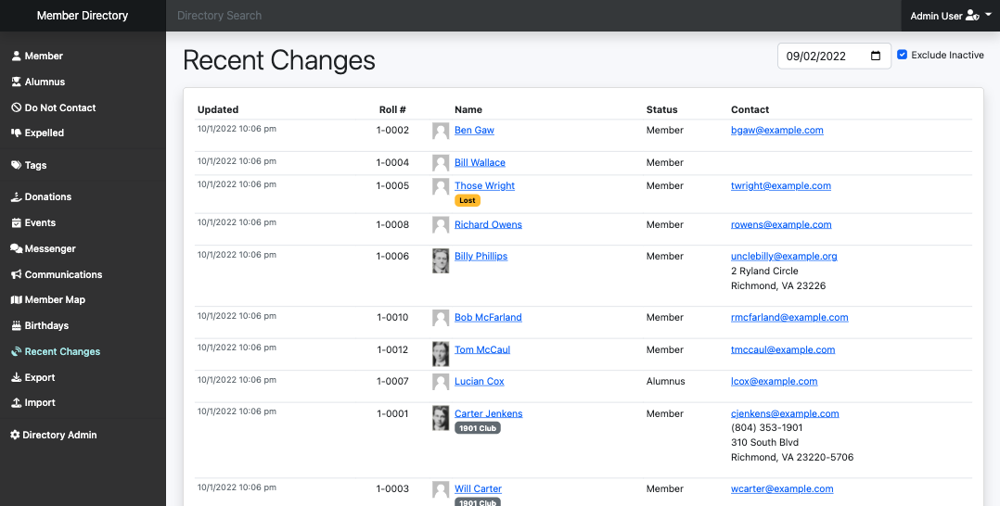

Track all of the recent changes to your membership data.

---

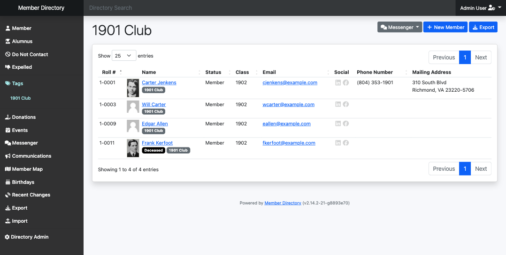

Tags allow for creating groups of members.

---

Search the member directory from any page.

---

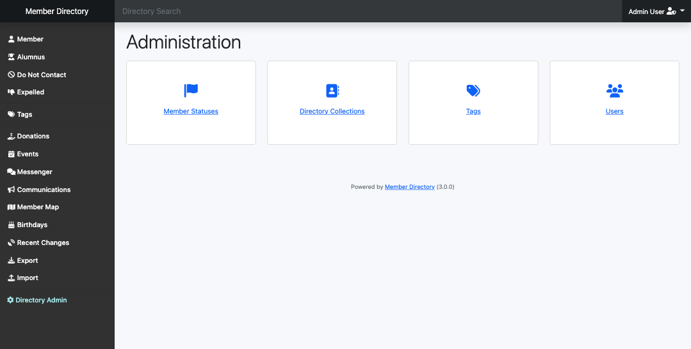

An admin section provides tools for configuring the directory and managing access.

---

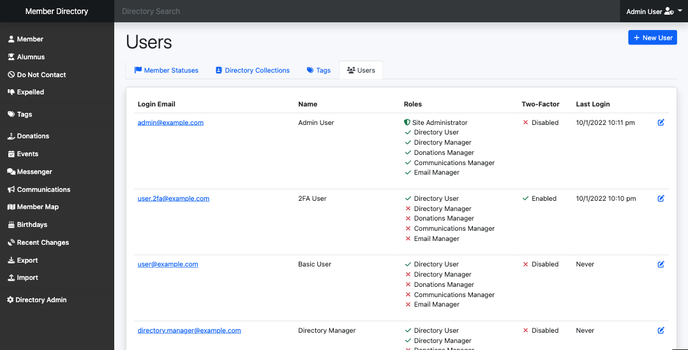

User roles control who can view and modify what information in the directory.

---

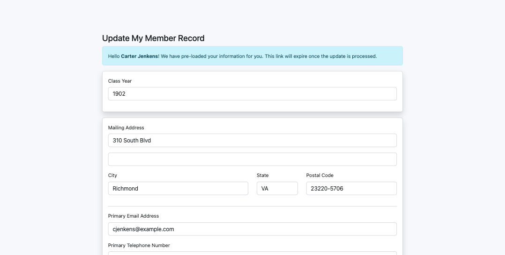

Through a secure link, members can update their own information.

---

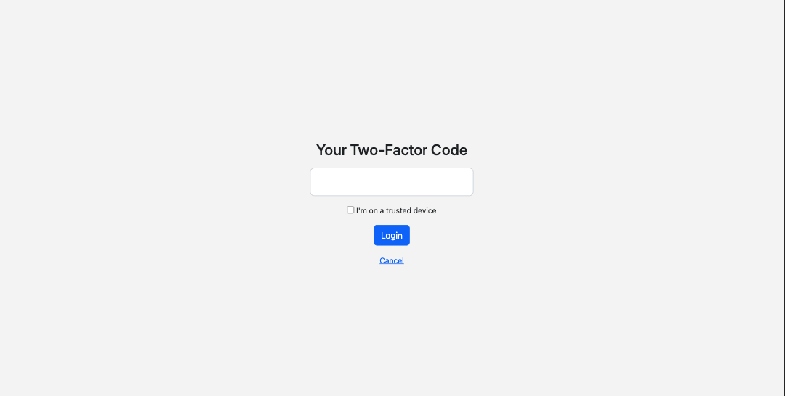

Secure your directory data with two-factor authentication.
